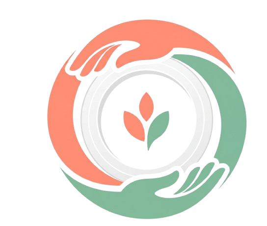
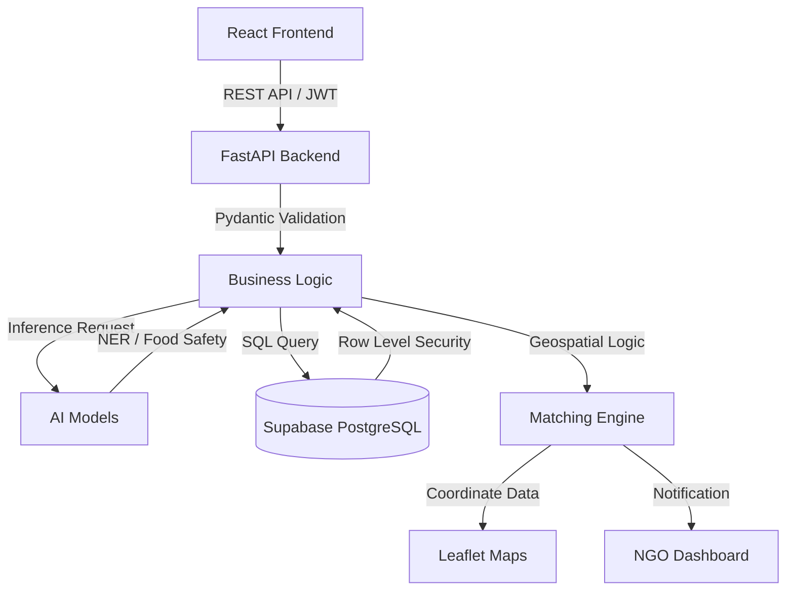
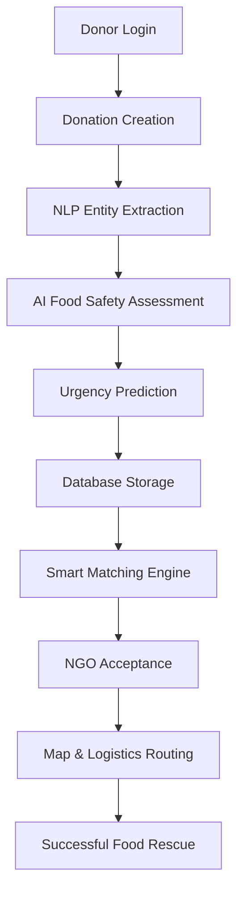

<div align="center">



# SharePlate
**AI-Powered Food Redistribution Platform**

[](#)
[](#)
[](#)
[](#)
[](#)
[](#)
[](#)
[](#)
[](#)
[](#)
[](#)
[](#)
[](#)

[Live Demo](https://share-plate-ivory.vercel.app) | [Backend API](https://shareplate-6afu.onrender.com) | [Swagger Documentation](https://shareplate-6afu.onrender.com/docs) | [Repository](https://github.com/somiya-namdeo/SharePlate)

</div>

<br />

<details>
  <summary><h2>Table of Contents</h2></summary>
  <ul>
    <li><a href="#project-overview">Project Overview</a></li>
    <li><a href="#project-highlights">Project Highlights</a></li>
    <li><a href="#features">Features</a></li>
    <li><a href="#screenshots">Screenshots</a></li>
    <li><a href="#ai--machine-learning">AI & Machine Learning</a></li>
    <li><a href="#tech-stack">Tech Stack</a></li>
    <li><a href="#system-architecture">System Architecture</a></li>
    <li><a href="#workflow">Workflow</a></li>
    <li><a href="#rest-api">REST API</a></li>
    <li><a href="#installation">Installation</a></li>
    <li><a href="#environment-variables">Environment Variables</a></li>
    <li><a href="#project-structure">Project Structure</a></li>
    <li><a href="#security">Security</a></li>
    <li><a href="#performance">Performance</a></li>
    <li><a href="#future-enhancements">Future Enhancements</a></li>
    <li><a href="#author">Author</a></li>
  </ul>
</details>

---

## Project Overview

**The Problem**
Globally, nearly one-third of all food produced is wasted while millions suffer from food insecurity. A massive logistics and communication gap exists between restaurants, events, and individuals with surplus food and the non-governmental organizations (NGOs) equipped to distribute it.

**The Motivation**
Traditional food rescue operations rely heavily on manual coordination, phone calls, and disjointed communication channels. This leads to inefficient routing, missed donation windows, and ultimately, preventable food spoilage.

**Why Food Redistribution is Difficult**
Food is highly perishable. Coordinating a safe rescue requires verifying food safety, estimating remaining shelf life, determining transportation urgency, and matching the donor with an NGO that has the immediate capacity and proximity to accept the food safely.

**How SharePlate Solves the Problem**
SharePlate is an end-to-end AI-powered food redistribution platform that connects food donors with NGOs. It automates logistics by utilizing intelligent food safety assessment, NLP-based donation extraction, smart donor-NGO matching, and geospatial logistics to ensure surplus food reaches those in need before it spoils.

**Real-World Impact**
By automating logistics and intelligently evaluating perishability, SharePlate maximizes the efficiency of food redistribution, reduces global food waste, and ensures compliance with critical food safety standards.

---

## Project Highlights

* AI-powered food safety assessment
* Natural language donation processing
* Role-based donor and NGO workflows
* Smart NGO matching
* Geospatial logistics
* Interactive dashboards
* REST API architecture
* Real-time donation management

---

## Features

### Donor Features
| Feature | Description |
|---|---|
| **Authentication** | Secure JWT-based login and registration workflows. |
| **Donation Creation** | Seamlessly submit surplus food details via structured forms or natural language descriptions. |
| **Logistics Tracking** | Real-time monitoring of donation status (Pending, Matched, Completed). |
| **Dashboard** | Comprehensive analytics and historical donation metrics. |

### NGO Features
| Feature | Description |
|---|---|
| **Secure Onboarding** | Role-based registration tailored specifically for NGOs. |
| **Browse Donations** | Geolocation-based browsing of available local surplus food. |
| **Accept Donations** | Claim food donations specifically tailored to current NGO capacity. |
| **Dashboard** | Track accepted requests, live logistics, and total historical impact. |

### AI Features
| Feature | Description |
|---|---|
| **Food Safety Prediction** | Evaluates raw features to determine if food is safe for human consumption. |
| **Shelf Life Prediction** | Estimates the exact remaining hours before food spoilage occurs. |
| **Urgency Classification** | Classifies urgency into Critical, High, or Low to optimize pickup speed. |
| **NLP Entity Extraction** | Extracts food entities, quantities, and locations automatically from unstructured text. |

### Platform Features
| Feature | Description |
|---|---|
| **Smart Matching** | Connects the right NGO to the right donor using dynamic availability and distance. |
| **Geospatial Logistics** | Calculates optimal routes and distances using Haversine formulas. |
| **Interactive Maps** | Live mapping interface using Leaflet and OpenStreetMap. |
| **Performance Analytics** | System-wide statistics on total meals rescued and active partnerships. |

---

## Screenshots

### Landing Page

*Demonstrates the primary marketing interface, highlighting core value propositions and platform statistics.*

### Donor Dashboard

*Displays real-time analytics, active donations, and historical contribution data for registered donors.*

### Donation Management

*Shows the interface for tracking and updating the status of submitted food donations.*

### AI Food Safety

*Illustrates the output of the CatBoost classification model predicting food safety and estimating remaining shelf life.*

### NLP Intelligence - Input

*Demonstrates the unstructured text input interface where donors can quickly describe surplus food.*

### NLP Intelligence - Extraction Result

*Displays the structured JSON output generated by the PyTorch BiLSTM Named Entity Recognition model.*

### NGO Dashboard

*Provides NGOs with a centralized view of claimed donations, pending logistics, and organizational impact.*

### Smart Matching - Recommendation

*Shows the algorithmically generated list of optimal NGO matches for a specific food donation.*

### Smart Matching - Assignment Queue

*Displays the prioritized queue of donations awaiting NGO acceptance based on urgency scores.*

### Map & Logistics

*Visualizes geospatial data using Leaflet, displaying live rescue zones and optimal routing paths.*

---

## AI & Machine Learning

Machine Learning is a core component of SharePlate's architecture, transforming a standard CRUD application into an intelligent logistics engine.

### Food Safety Assessment
* **Model Used**: CatBoost Classifier
* **Purpose**: Determines if donated food is safe for human consumption and estimates remaining shelf life.
* **Inputs**: Ingredients, ambient temperature, humidity, and storage conditions.
* **Outputs**: Binary safety classification (Safe/Unsafe), estimated shelf life in hours, and a confidence score.
* **Reason for Choosing**: CatBoost natively handles categorical features without extensive preprocessing and provides robust performance on tabular data.
* **Implementation**: The model is serialized via Joblib, loaded lazily at application startup, and exposed via FastAPI endpoints.

### Urgency Prediction
* **Model Used**: Gradient Boosting Regressor (Scikit-Learn)
* **Purpose**: Calculates a priority score determining logistics priority.
* **Inputs**: Estimated shelf life, current time, and food category.
* **Outputs**: Priority score (0-100) and discrete ranking (Critical, High, Low).
* **Reason for Choosing**: Gradient boosting effectively captures non-linear relationships in temporal decay data.
* **Implementation**: Integrated into the donation creation pipeline to automatically assign SLAs (Service Level Agreements) to new donations.

### Natural Language Processing (NLP)
* **Model Used**: Custom PyTorch BiLSTM + Attention Named Entity Recognition (NER)
* **Purpose**: Parses unstructured text descriptions provided by donors into structured database fields.
* **Inputs**: Raw text (e.g., "We have 20 kg of fresh rice available for pickup at MP Nagar.").
* **Outputs**: Structured JSON extracting Food Item, Quantity, Location, and Pickup Time.
* **Reason for Choosing**: BiLSTM architectures excel at sequence tagging, and the attention mechanism helps the model focus on highly relevant context words.
* **Implementation**: Deployed natively in PyTorch. The inference pipeline tokenizes the string, passes it through the BiLSTM, and decodes the entities.

### Smart Matching
* **Logic**: A multi-objective optimization algorithm.
* **Purpose**: Pairs donors with the optimal NGO.
* **Implementation**: The matching engine evaluates:
  1. **Haversine Distance**: Calculates strict geospatial proximity between coordinates.
  2. **Compatibility**: Ensures the NGO accepts the specific food category.
  3. **Urgency & Safety**: Prioritizes NGOs capable of immediate pickup for highly perishable items.
  4. **Availability**: Checks real-time NGO operational hours.

### Demand Forecasting
* **Model Used**: PyTorch Deep Neural Network (DNN)
* **Purpose**: Predicts future demand and surplus patterns in specific geographic zones.
* **Inputs**: Historical donation volume, regional demographics, and temporal data.
* **Outputs**: Predicted volume of required meals per zone.
* **Reason for Choosing**: Deep Neural Networks scale efficiently with large historical datasets and capture complex multi-dimensional patterns.

**Core ML Libraries Used:** PyTorch, Scikit-Learn, NumPy, Pandas, Joblib.

---

## Tech Stack

### Frontend
| Technology | Role |
|---|---|
| **React** | Core component-based UI library. |
| **TypeScript** | Static typing for enterprise-grade safety. |
| **Vite** | Extremely fast build tool and development server. |
| **Tailwind CSS** | Utility-first framework for rapid, responsive styling. |
| **React Router** | Client-side routing management. |
| **Axios / Fetch** | Asynchronous HTTP client for API communication. |
| **Lucide React** | Consistent, clean iconography. |

### Backend
| Technology | Role |
|---|---|
| **FastAPI** | High-performance, asynchronous Python web framework. |
| **Python** | Core backend language. |
| **Pydantic** | Strict data validation and settings management. |
| **JWT** | Stateless authentication token generation. |
| **Supabase SDK** | Official Python client for database interactions. |

### Database & Authentication
| Technology | Role |
|---|---|
| **Supabase PostgreSQL** | Highly scalable relational database. |
| **Supabase Auth** | Manages user credentials and session initialization. |
| **JWT** | Secures API endpoints. |
| **Row Level Security (RLS)** | Ensures users can only access their authorized data. |

### Machine Learning
| Technology | Role |
|---|---|
| **PyTorch** | Powers the BiLSTM NER model and DNN forecasting. |
| **Scikit-Learn** | Data preprocessing pipelines and Gradient Boosting. |
| **Random Forest** | Used in ensemble predictions. |
| **CatBoost** | Handles tabular food safety classification natively. |

### Infrastructure
| Technology | Role |
|---|---|
| **Render** | Hosts the FastAPI backend application. |
| **Vercel** | Hosts the React frontend via Edge Networks. |
| **Leaflet & OpenStreetMap** | Powers interactive geospatial mapping. |
| **GitHub** | Source code management and version control. |

---

## System Architecture



---

## Workflow



---

## REST API

### Authentication
* `POST /api/auth/signup` - Register a new donor or NGO.
* `POST /api/auth/login` - Authenticate user and return JWT session.

### Donations
* `POST /api/donations/` - Create a new food donation record.
* `GET /api/donations/` - Retrieve all available public donations.
* `GET /api/donations/me` - Retrieve donations created by the authenticated user.

### Requests
* `POST /api/requests/` - NGO initiates a request to claim a donation.
* `GET /api/requests/me` - Retrieve all active requests for the authenticated NGO.

### AI Intelligence
* `POST /api/ai/food-safety` - Execute the CatBoost model to predict food safety and shelf life.
* `POST /api/ai/donation-ner` - Execute the PyTorch BiLSTM to extract entities from raw text.

### Smart Matching
* `GET /api/matches/me` - Execute geospatial matching logic to return recommended NGO/Donor pairs.

### Analytics
* `GET /api/analytics/` - Retrieve platform-wide metrics (total meals, active zones).

---

## Installation

### Prerequisites
* Node.js (v18 or higher)
* Python (3.11 or higher)
* Git

### 1. Clone the Repository
```bash
git clone https://github.com/somiya-namdeo/SharePlate.git
cd SharePlate
```

### 2. Backend Setup
```bash
cd backend
python -m venv .venv
# Activate the virtual environment
# Windows: .venv\Scripts\activate
# macOS/Linux: source .venv/bin/activate
pip install -r requirements.txt
```

### 3. Running the Backend
```bash
uvicorn app.main:app --reload --host 0.0.0.0 --port 8000
```
*The backend will be available at `http://localhost:8000`*

### 4. Frontend Setup
```bash
cd ../frontend
npm install
```

### 5. Running the Frontend
```bash
npm run dev
```
*The frontend will be available at `http://localhost:5173`*

---

## Environment Variables

To run this project, you will need to add the following environment variables.

### Frontend (`frontend/.env`)
```env
VITE_API_URL=http://localhost:8000
```

### Backend (`backend/.env`)
```env
SUPABASE_URL=your_supabase_project_url
SUPABASE_KEY=your_supabase_anon_key
SUPABASE_SERVICE_ROLE_KEY=your_supabase_service_key
JWT_SECRET=your_secure_jwt_secret
FRONTEND_URL=http://localhost:5173
```

---

## Project Structure

```text
SharePlate/
├── backend/
│   ├── app/
│   │   ├── api/
│   │   ├── core/
│   │   ├── models/
│   │   ├── schemas/
│   │   ├── services/
│   │   └── main.py
│   ├── requirements.txt
│   └── .env
├── frontend/
│   ├── public/
│   ├── src/
│   │   ├── assets/
│   │   ├── components/
│   │   │   ├── dashboard/
│   │   │   ├── layout/
│   │   │   ├── sections/
│   │   │   └── ui/
│   │   ├── lib/
│   │   ├── pages/
│   │   ├── App.tsx
│   │   └── main.tsx
│   ├── package.json
│   ├── vite.config.ts
│   └── .env
├── models/
│   ├── shareplate_food_safety_model.pkl
│   ├── shareplate_ner_bilstm_attention_v2.pth
│   └── shareplate_surplus_food_predictor.pkl
└── README.md
```

---

## Security

* **JWT Authentication**: Utilizes stateless, cryptographically signed JSON Web Tokens for API authorization.
* **Role-Based Access Control (RBAC)**: Strict API routing ensures Donors cannot access NGO-specific logistics endpoints, and vice versa.
* **Protected Routes**: React Router explicitly blocks unauthenticated access to dashboard views.
* **Supabase Security**: Row Level Security (RLS) policies deployed in PostgreSQL prevent cross-tenant data leakage.
* **Environment Variables**: Total isolation of database keys, secrets, and API URLs.
* **CORS**: Configured in FastAPI to strictly allow only the verified frontend origin in production.

---

## Performance

* **FastAPI Async Backend**: Handles thousands of concurrent HTTP requests natively without blocking the event loop.
* **Optimized ML Inference**: Utilizes pre-compiled Scikit-Learn pipelines and fast CatBoost decision trees for sub-100ms inference times.
* **Lazy Model Loading**: Serialized `.pkl` and `.pth` models are lazy-loaded into memory only upon their first invocation, preventing Out-Of-Memory (OOM) crashes during server startup and drastically reducing boot times.
* **Frontend Optimization**: Built with Vite and React for aggressive code splitting, optimized asset delivery, and immediate Hot Module Replacement (HMR).

---

## Future Enhancements

* **Volunteer Application**: Introduce a third user role for independent volunteers to handle last-mile delivery.
* **OCR-Based Donation Extraction**: Allow donors to scan physical inventory receipts using Optical Character Recognition.
* **Image-Based Spoilage Detection**: Expand the PyTorch models to utilize Convolutional Neural Networks (CNNs) for visual spoilage detection from uploaded photos.
* **Push Notifications**: Implement real-time WebSockets or Progressive Web App (PWA) notifications for critical matches.
* **Route Optimization**: Integrate traveling salesperson algorithms to optimize multi-stop NGO pickups.
* **Live Tracking**: Add real-time GPS tracking for active food deliveries.

---

## Author

**Name**: Somiya Namdeo  
**GitHub**: [https://github.com/somiya-namdeo](https://github.com/somiya-namdeo)  
**LinkedIn**: [https://www.linkedin.com/in/somiya-namdeo-/](https://www.linkedin.com/in/somiya-namdeo-/)
