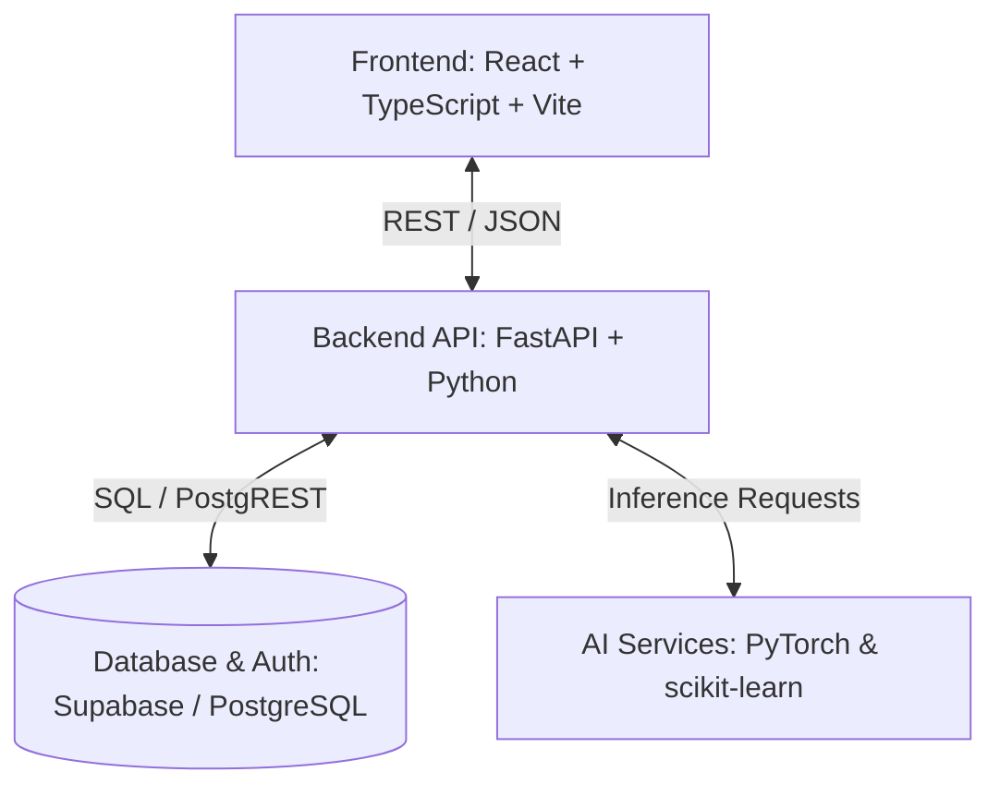

<div align="center">
  
  
  <h1>SharePlate</h1>
  <p><b>AI-Powered Food Redistribution Platform</b></p>
  <p>
    <a href="https://github.com/somiya-namdeo/SharePlate">
      
    </a>
  </p>
  <p>Connecting surplus food with real community demand through intelligent safety assessment, prioritization, matching, and operational insights.</p>

  <!-- Technology Badges -->
  <p>
    
    
    
    
    
    
    
    
    
    
  </p>

  <i>Current status: Core application implemented; deployment and final documentation/screenshots in progress.</i>
</div>

---

## Why SharePlate?

Food can often be left unused or wasted while nearby communities and organizations still urgently need meals. The challenge is not simply that food exists or that demand exists. The real challenge is **coordination**. 

Successfully redistributing surplus food requires managing limited shelf life, assessing food safety, determining the urgency of donations, and matching those donations to NGOs with actual demand in real-time. It is a complex operational and logistical problem, not just a listing problem.

SharePlate is designed as an AI-assisted food redistribution platform connecting food donors and NGOs so surplus food can move toward real demand more intelligently. The platform aims to reduce avoidable food waste, support better redistribution decisions, and assist both donors and NGOs in coordinating rescues efficiently and safely.

## What SharePlate Does

SharePlate streamlines the end-to-end food rescue workflow:

1. **Donation Creation**: A donor creates a food donation (either manually or using AI-assisted text extraction).
2. **Safety Assessment**: Food information is evaluated through an AI-assisted food safety workflow to determine spoilage risk and urgency.
3. **Demand Registration**: An NGO creates a request based on the specific food or meals needed.
4. **Intelligent Matching**: Donations and requests are prioritized and matched through the platform's matching workflow.
5. **Rescue Coordination**: Matches progress through real supported statuses (`pending`, `suggested`, `accepted`, `rejected`, `picked_up`, `completed`, `cancelled`).
6. **Role-Aware Dashboards**: Donors and NGOs track their own activity through customized views.
7. **Operational Analytics**: Dashboards summarize real rescue operations and platform activity.

## Core Features

### Authentication & Role-Aware Experience
Powered by Supabase Auth, SharePlate securely routes users to role-specific experiences for **Donors** and **NGOs** after login. Profiles manage organization details, locations, and dynamic user identity behavior.

### Food Donation Management
Donors can post available food with rich metadata, including food category, quantity, preparation details (temperature, hours since prepared), and storage conditions. Donors have a dedicated view to track the status of their active and historical donations.

### NGO Request Management
NGOs can create granular requests specifying the meals needed, urgency level (Low, Medium, High, Critical), preferred food types, and location data to signal demand to the network.

### AI-Assisted Food Safety
The platform integrates a safety assessment engine that evaluates donation parameters to return a calculated **safety status**, **spoilage risk**, **urgency score/level**, and **predicted remaining shelf life**.

### Matching & Rescue Workflow
The backend evaluates geographical distance and priority levels to suggest matches between active donations and NGO requests. Both parties can interact with these matches to coordinate the physical rescue.

### Role-Aware Overview
- **Donors** see their own donations, suggested matches, and metrics on total rescued quantity.
- **NGOs** see metrics and operational information relevant to their open requests, accepted matches, and fulfilled meals.

### Operations Analytics
A dedicated analytics dashboard provides insights into successful rescues, total quantity rescued, meals fulfilled, active requests, and donations over time.

### Account Settings
Users can manage their editable profile fields, view read-only email constraints, update their passwords, and manage platform preferences like AI thresholds (safety/match scores) and pickup preferences.

## Role-Based Experience

| Capability | Donor | NGO |
|------------|-------|-----|
| **Core Action** | Post available surplus food | Request meals / food types |
| **Tracking** | Monitor donation status and food safety scores | Monitor request fulfillment and urgency |
| **Matching** | View and approve NGO matches | View and accept available donations |
| **Insights** | Track total food rescued by their organization | Track meals fulfilled and active demand |

## System Architecture

SharePlate uses a modern, decoupled client-server architecture powered by a relational database and dedicated machine learning services.



### Frontend
Built with **React**, **TypeScript**, and **Vite**, utilizing **Tailwind CSS** for responsive styling. It handles role-based routing, form validations, interactive maps (Leaflet), and data visualization (Recharts).

### Backend
A **FastAPI** application written in Python, exposing a robust REST API. It handles business logic, request/donation matching algorithms, and orchestrates calls to the AI service layer.

### Database & Authentication
**Supabase** (PostgreSQL) is used for secure authentication, row-level security (RLS), and persistent storage of profiles, donations, requests, and match records.

### AI/ML Layer
A dedicated Python service loads trained model artifacts (Pickle and PyTorch formats) into memory at startup to serve real-time predictions for food safety, NLP entity extraction, and surplus forecasting.

## Technology Stack

| Layer | Technologies |
|-------|--------------|
| **Frontend** | React 19, TypeScript, Vite, Tailwind CSS 4, React Router, Leaflet, Recharts, Framer Motion |
| **Backend** | FastAPI, Python 3, Pydantic, Uvicorn |
| **Database & Auth** | Supabase, PostgreSQL |
| **Machine Learning** | PyTorch, scikit-learn, CatBoost, Pandas, NumPy |

## AI & Machine Learning

SharePlate distinctly separates actively integrated application features from ongoing data science research.

### Actively Integrated Models
These models are loaded by the FastAPI backend and used directly in the application workflow:

- **Food Safety & Urgency Engine** (`shareplate_food_safety_model.pkl`): Evaluates food category, temperature, time since preparation, and perishability to output an estimated remaining shelf life and urgency score.
- **Donation NER Extraction** (`shareplate_ner_bilstm_attention_v2.pth`): A PyTorch BiLSTM model with Attention that automatically extracts entities (food items, quantities, locations, pickup times) from unstructured donor text input.
- **Surplus Food Predictor** (`shareplate_surplus_food_predictor.pkl`): Analyzes features to predict the expected quantity of surplus food.

---

## Surplus Food Prediction Experiments

The repository includes an experimental ML workflow located in `notebooks/01_SharePlate_Surplus_Food_Prediction.ipynb`. This pipeline explores the feasibility of predicting surplus food quantities based on historical factors. 

It evaluates robust algorithms (including Random Forest, Gradient Boosting, XGBoost, LightGBM, and CatBoost) to understand complex, non-linear patterns in surplus generation. The best performing model from these experiments is serialized and integrated into the active application.

## Demand Forecasting Experiments

To better anticipate community needs, the repository contains research on demand forecasting in `notebooks/03_SharePlate_Demand_Forecasting.ipynb`. 

This experiment explores a Deep Neural Network (DNN) architecture built with PyTorch, taking multiple input features through several hidden layers (e.g., 128 → 64 → 32) using ReLU activation and Dropout. The resulting artifact (`shareplate_demand_forecasting_dnn.pth`) serves as an experimental capability to study how NGO demand fluctuates over time and is available for further experimentation.

## Experimenting with the ML Models

ML engineers, students, and contributors are highly encouraged to explore the Jupyter notebooks and model artifacts. You can clone the repository to inspect the data preprocessing, compare algorithm performance, and test model artifacts locally.

```bash
# Clone the repository
git clone https://github.com/somiya-namdeo/SharePlate.git
cd SharePlate

# Set up the Python environment
cd backend
python -m venv venv
source venv/bin/activate  # On Windows: venv\Scripts\activate
pip install -r requirements.txt

# Start Jupyter to explore the notebooks
jupyter notebook ../notebooks/
```
