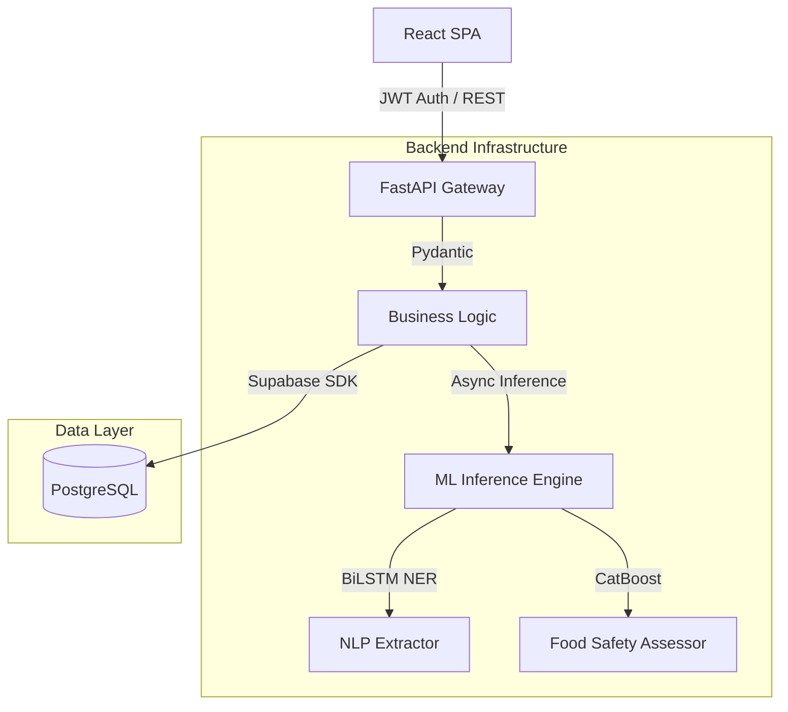

<div align="center">


# SharePlate
### AI-Powered Food Redistribution Platform

SharePlate is an AI-first platform that connects food donors with NGOs using Machine Learning, Natural Language Processing, and geospatial logistics to reduce global food waste and optimize redistribution.

[](#)
[](#)
[](#)
[](#)
[](#)
[](#)

[Live Production](https://share-plate-ivory.vercel.app) | [Backend API](https://shareplate-6afu.onrender.com) | [API Documentation](https://shareplate-6afu.onrender.com/docs)

</div>

<br />

## Overview

Globally, nearly one-third of all food produced is wasted while millions suffer from food insecurity. The core issue isn't a lack of food—it's a logistics and communication breakdown. Traditional food rescue operations rely heavily on manual coordination, phone calls, and disjointed communication channels. For donors, it's difficult to know who needs the food. For NGOs, it's impossible to manually assess the safety and perishability of every spontaneous donation. 

SharePlate was built to solve this. By integrating AI at the core of the platform, SharePlate automates the heavy lifting: from understanding raw text donations via NLP, to predicting food safety using classification models, and finally matching the food to the optimal NGO based on geospatial distance and urgency.

---

## Project Evolution

This project started with a simple question: *How can we make food donation completely frictionless while guaranteeing safety?*

The journey evolved naturally:
1. **The Problem:** Donors abandon the donation process if it takes too long. NGOs reject food if they can't verify its safety or shelf life.
2. **Research & Data Collection:** I started synthesizing tabular logistics data for food safety and building text datasets for donation requests.
3. **Machine Learning Experiments:** I trained baseline models (Random Forest, Gradient Boosting) to classify food safety, iteratively discovering the strengths of gradient boosting algorithms on high-cardinality data.
4. **NLP Development:** To solve the friction problem, I built a custom Deep Learning model to extract entities directly from unstructured text rather than forcing donors to fill out tedious forms.
5. **Backend Integration:** Wrapped the trained `.pkl` and `.pth` models in a highly concurrent FastAPI asynchronous backend.
6. **Frontend & Final Product:** Built a clean, role-based React dashboard to visualize the logistics, bridging the AI predictions with real-world users.

---

## AI & Machine Learning

SharePlate is an AI-first project. The machine learning pipeline is the engine that drives the entire application.

### Food Safety Prediction (CatBoost)
**The Problem:** When an event organizer has 50kg of surplus food, an NGO needs to instantly know: *Is this safe to eat, and how much time do we have to transport it?*

**The Experiments:** I began with simple Random Forest classifiers to predict safety based on 19 features including `temperature`, `humidity`, `hours_since_prepared`, and `packaging_type`. While Random Forest established a decent baseline, the dataset's high-cardinality categorical variables required massive one-hot encoding matrices, slowing down training and inference. 
I evaluated XGBoost and LightGBM, but ultimately selected **CatBoost**. CatBoost handles categorical features natively and built optimal decision trees significantly faster on this specific dataset.

**The Final Model:** 
The deployed CatBoostClassifier triages donations into `Safe`, `Review`, or `Unsafe`.
* **Accuracy:** 92.35%
* **Weighted F1-Score:** 0.92

*(Note: During experimentation, I also trained a model to predict logistical 'Urgency' which hit 99.6% accuracy. However, feature analysis revealed target leakage—the labels were directly derived from the shelf-life feature. I opted to scrap the ML urgency model in favor of deterministic business logic to keep the pipeline mathematically sound).*

### NLP Donation Extraction (PyTorch)
**The Problem:** Donors want to type *"We have 10kg of cooked rice available at MP Nagar"* and be done. Traditional regex fails at robustly extracting context-dependent entities, and calling external LLM APIs introduces latency and cost.

**The Solution:** I built a custom Sequence Tagging model.
* **Architecture**: **PyTorch BiLSTM + Attention**. 
* **Why BiLSTM + Attention?**: A Bidirectional LSTM processes the text both forwards and backwards, capturing the context of a word based on the entire sentence. The Attention mechanism allows the network to assign dynamic weights to the most important words. It is incredibly lightweight, runs natively on the CPU, and executes in milliseconds.
* **Extracted Entities**: The model tokenizes the input and decodes sequence labels for `B-EVENT_TYPE`, `B-FOOD_TYPE`, `B-LOCATION`, and `B-QUANTITY`, instantly converting raw text into structured JSON.

**Evaluation:**
* **Accuracy:** 97.41%
* **Precision:** 97.44%
* **F1-Score:** 97.34%

*(Training loss curves and extracted confusion matrices are available in the `assets/readme/` folder).*

### Demand Forecasting (Deep Neural Network)
**The Problem:** NGOs need to anticipate surplus trends to allocate their volunteers effectively.
* **Dataset**: 456,548 historical logistics records.
* **Architecture**: A PyTorch Deep Neural Network (DNN) trained with Mean Squared Error (MSE) loss and the Adam optimizer.
* **Evaluation**: To prevent time-series data leakage (where a model trains on future data to predict the past), I used a strict chronological train/test split.
* **Metrics**: The model achieved a realistic Mean Absolute Error (MAE) of **113.88** on unseen future weeks.

---

## Features & Visual Interface

SharePlate wraps these AI engines in a clean, intuitive, and highly responsive user interface.

* **NLP-powered Donation Extraction:** Donors submit raw text; the system structures it automatically.
* **AI-based Food Safety Assessment:** Instant prediction of human-consumption safety based on tabular features.
* **Smart NGO Matching:** Uses Haversine distance and availability routing to optimize pickups.
* **Interactive Maps:** Real-time geospatial rendering of active logistics.
* **Role-based Authentication:** Distinct workflows and secure dashboards for Donors vs. NGOs.

### Platform Screenshots

**Overview & Dashboards**


**AI Intelligence in Action**

*Raw unstructured input provided by the donor.*


*The decoded sequence output mapped perfectly to the database schema.*

.png)
*Real-time CatBoost risk triage.*

**Geospatial Logistics**

*Algorithmically generated list of optimal NGO matches based on urgency and distance.*


*Visualizing geospatial data using Leaflet to display live rescue zones and optimal routing paths.*

---

## Architecture

The system is decoupled into an asynchronous Python backend handling inference and a TypeScript/React frontend managing state and geospatial visualization.



---

## Technology Stack

* **Machine Learning**: `PyTorch`, `CatBoost`, `Scikit-Learn`, `Pandas`
* **Backend**: `FastAPI`, `Python`, `JWT`
* **Frontend**: `React`, `TypeScript`, `Vite`, `Tailwind CSS`
* **Database**: `Supabase` (PostgreSQL)
* **Maps**: `Leaflet`, `OpenStreetMap`

---

## Lessons Learned

Building a production-ready AI application taught me several practical engineering lessons:

* **Why Model Comparison Matters**: Starting with simple models like Random Forest provided a baseline that proved CatBoost's superiority in handling tabular food safety data without heavy preprocessing.
* **Why Target Leakage is Dangerous**: Discovering that my 99.6% accurate urgency model was mathematically cheating (because the label was derived directly from an input feature) was a pivotal moment. It reinforced the importance of rigorously auditing feature sets.
* **Importance of Evaluation Strategies**: In demand forecasting, switching from a random data split to a chronological split completely changed the metrics, proving that time-series models must be evaluated against the future, not the past.
* **Practical Deployment Considerations**: Large `.pth` and `.pkl` models consume massive amounts of RAM. To deploy successfully on restricted cloud tiers (like Render's 512MB limit), I learned to implement lazy-loading patterns, caching models into memory only when an endpoint is actually triggered.

---

## API Reference

The backend exposes a strictly typed REST API. Key endpoints include:

* `POST /api/auth/signup` - Registers Donors/NGOs and initializes records.
* `POST /api/auth/login` - Authenticates and returns JWT payload.
* `POST /api/donations/` - Submits a new donation record.
* `GET /api/matches/me` - Executes geospatial matching returning optimal NGO/Donor pairs based on Haversine distance.
* `POST /api/ai/food-safety` - Deserializes tabular input and executes the CatBoost pipeline.
* `POST /api/ai/donation-ner` - Tokenizes raw text strings and executes the PyTorch BiLSTM forward pass.

---

## Local Setup

### 1. Clone & Database Setup
```bash
git clone https://github.com/somiya-namdeo/SharePlate.git
cd SharePlate
```

### 2. Backend Bootstrapping
```bash
cd backend
python -m venv venv
source venv/bin/activate  # Windows: venv\Scripts\activate
pip install -r requirements.txt
```
Create `backend/.env`:
```env
SUPABASE_URL=<YOUR_URL>
SUPABASE_KEY=<YOUR_KEY>
JWT_SECRET=<YOUR_SECRET>
```
Run the server:
```bash
uvicorn app.main:app --reload --host 0.0.0.0 --port 8000
```

### 3. Frontend Bootstrapping
```bash
cd ../frontend
npm install
```
Create `frontend/.env`:
```env
VITE_API_URL=http://localhost:8000
```
Run the development server:
```bash
npm run dev
```

---

## Future Work

* **Volunteer Application**: Introduce a third user role for independent volunteers to handle last-mile delivery.
* **OCR-Based Donation Extraction**: Allow donors to scan physical inventory receipts using Optical Character Recognition.
* **Image-Based Spoilage Detection**: Expand the PyTorch models to utilize Convolutional Neural Networks (CNNs) for visual spoilage detection from uploaded photos.

---

## Author

**Somiya Namdeo**
* GitHub: [somiya-namdeo](https://github.com/somiya-namdeo)
* LinkedIn: [Somiya Namdeo](https://www.linkedin.com/in/somiya-namdeo-/)
