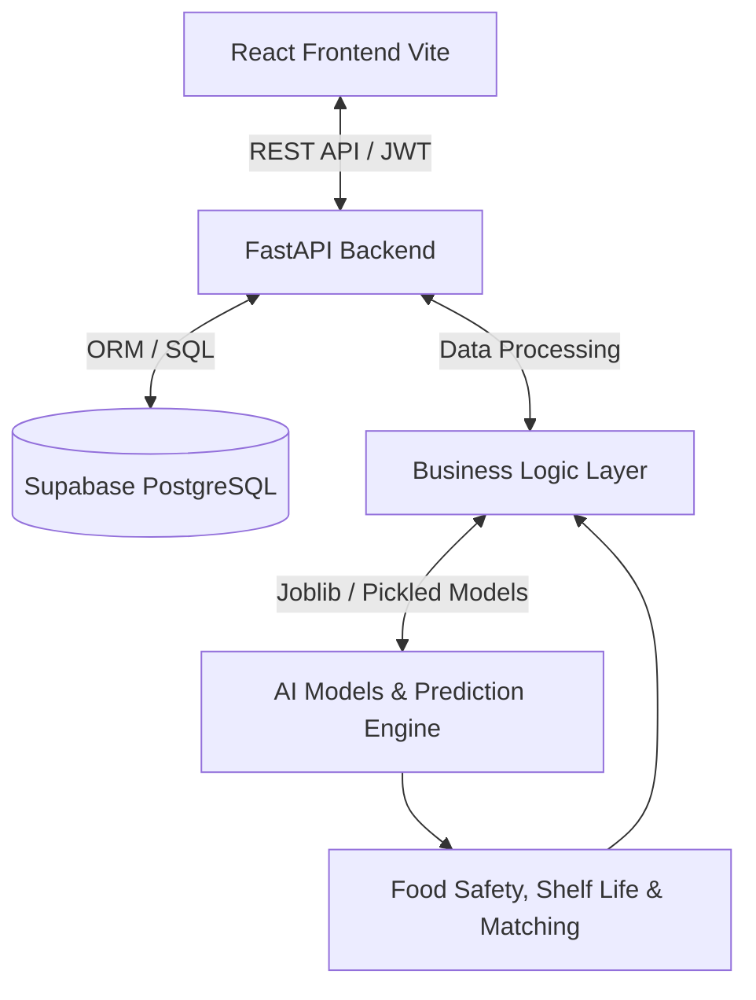

<div align="center">

# SharePlate
**AI-Powered Food Redistribution Platform**

[](#)
[](#)
[](#)
[](#)

[Live Demo](https://share-plate-ivory.vercel.app) • [Backend API](https://shareplate-6afu.onrender.com) • [API Documentation](https://shareplate-6afu.onrender.com/docs)

</div>

<br />

<details>
  <summary><h2>Table of Contents</h2></summary>
  <ul>
    <li><a href="#-overview">Overview</a></li>
    <li><a href="#-key-features">Key Features</a></li>
    <li><a href="#-system-architecture">System Architecture</a></li>
    <li><a href="#-technology-stack">Technology Stack</a></li>
    <li><a href="#-machine-learning-pipeline">Machine Learning Pipeline</a></li>
    <li><a href="#-project-workflow">Project Workflow</a></li>
    <li><a href="#-deployment-links">Deployment Links</a></li>
    <li><a href="#-screenshots">Screenshots</a></li>
    <li><a href="#-api-reference">API Reference</a></li>
    <li><a href="#-installation--setup">Installation & Setup</a></li>
    <li><a href="#-environment-variables">Environment Variables</a></li>
    <li><a href="#-project-structure">Project Structure</a></li>
    <li><a href="#-security-features">Security Features</a></li>
    <li><a href="#-performance-highlights">Performance Highlights</a></li>
    <li><a href="#-future-improvements">Future Improvements</a></li>
    <li><a href="#-contributing">Contributing</a></li>
    <li><a href="#-license">License</a></li>
    <li><a href="#-author">Author</a></li>
  </ul>
</details>

---

## Overview

### The Problem
Globally, nearly **one-third of all food produced is wasted**, while millions suffer from food insecurity. A massive logistics and communication gap exists between restaurants, events, and individuals with surplus food and the non-governmental organizations (NGOs) that can distribute it.

### The Solution
**SharePlate** bridges this gap by providing an intelligent, real-time platform connecting food donors with NGOs. We ensure that surplus food reaches those in need before it spoils.

### The AI-Powered Approach
SharePlate goes beyond standard CRUD applications by heavily integrating Machine Learning. We utilize **Natural Language Processing (NER)** to automatically extract donation details, **Tree-based Ensembles (CatBoost, XGBoost, Random Forest)** for predictive food safety and urgency scoring, and **Deep Neural Networks (DNN)** for demand forecasting. 

### Real-World Impact
By automating logistics and intelligently evaluating the safety and perishability of food, SharePlate maximizes the efficiency of food redistribution, reduces global food waste, and ensures compliance with critical food safety standards.

---

## Key Features

### Donor Features
* **Authentication**: Secure JWT-based login and registration.
* **Donation Creation**: Seamlessly submit surplus food details.
* **AI Food Safety Prediction**: Instant, automated safety and urgency evaluation.
* **Donation Tracking**: Real-time status updates (Pending, Matched, Completed).
* **Dashboard**: Comprehensive analytics and historical donation data.

### NGO Features
* **Authentication**: Secure role-based login.
* **Browse Donations**: Geolocation-based browsing of available local surplus food.
* **Accept Donations**: Claim food donations specifically tailored to NGO capacity.
* **Dashboard**: Track accepted requests, logistics, and historical impact.

### AI Features
* **Food Safety Prediction**: Evaluates raw features to determine if food is safe for human consumption.
* **Shelf Life Prediction**: Estimates the exact remaining hours before food spoilage.
* **Urgency Prediction**: Classifies urgency into Critical, High, or Low to optimize pickup speed.
* **BiLSTM-Attention NER**: Automatically extracts food entities, quantities, and properties from unstructured text.
* **Smart Matching**: Connects the right NGO to the right donor using dynamic availability.
* **Geospatial Logistics**: Calculates optimal routes and distances using Haversine formulas.

---

## System Architecture



---

## Technology Stack

### Frontend
| Technology | Description |
|---|---|
| **React** | Core UI library |
| **Vite** | Fast frontend build tool |
| **TailwindCSS** | Utility-first styling |
| **Axios/Fetch** | API communication |

### Backend
| Technology | Description |
|---|---|
| **FastAPI** | High-performance async Python web framework |
| **Pydantic** | Data validation and parsing |
| **Uvicorn** | ASGI Web Server |
| **Python-Multipart** | Form data parsing |

### Database
| Technology | Description |
|---|---|
| **Supabase** | Backend-as-a-Service |
| **PostgreSQL** | Relational Database |

### Machine Learning
| Technology | Description |
|---|---|
| **PyTorch** | Deep Neural Networks & BiLSTM models |
| **CatBoost / XGBoost** | Gradient boosting algorithms |
| **Scikit-Learn** | Data preprocessing & Voting Ensembles |
| **Joblib** | Model serialization |

### Deployment & Tools
| Technology | Description |
|---|---|
| **Vercel** | Frontend Edge Deployment |
| **Render** | Backend Cloud Deployment |
| **Swagger UI** | Auto-generated API Documentation |
| **Git & GitHub** | Version Control |

---

## Machine Learning Pipeline

1. **BiLSTM-Attention Named Entity Recognition (NER)**: A custom PyTorch neural network that parses unstructured text descriptions provided by donors to extract food items, conditions, and properties automatically.
2. **Food Safety Prediction**: A `CatBoostClassifier` trained to analyze ingredients, ambient temperature, humidity, and storage conditions to classify food as Safe or Unsafe.
3. **Shelf Life Estimation**: A CatBoost Regressor that accurately predicts the remaining viable hours of food.
4. **Urgency Prediction**: Calculates a priority score (0-100) determining the logistics priority using shelf-life utilization percentages.
5. **Geospatial Smart Matching**: Utilizes the **Haversine Distance** formula to dynamically pair donors with the closest available NGO.
6. **Confidence Scores**: Every AI prediction provides a confidence score, ensuring high reliability for critical human-consumption decisions.

---

## Project Workflow

1. **User Login**: Users authenticate securely via JWT as either a Donor or an NGO.
2. **Donation Submission**: Donors submit food surplus details (or unstructured text).
3. **NLP Entity Extraction**: The BiLSTM NER engine parses the text and standardizes the features.
4. **Food Safety Prediction**: The CatBoost engine calculates the perishability and urgency level.
5. **Database Storage**: The validated, AI-scored donation is stored in Supabase PostgreSQL.
6. **Smart Matching**: The algorithm alerts nearby NGOs based on geospatial limits and matching criteria.
7. **NGO Acceptance**: An NGO reviews the AI score and accepts the donation.
8. **Logistics**: Routing and pickup workflows are initiated.
9. **Completion**: The donation is collected, and analytics dashboards are updated.

---

## Deployment Links

* **Frontend (Vercel)**: [https://share-plate-ivory.vercel.app](https://share-plate-ivory.vercel.app)
* **Backend (Render)**: [https://shareplate-6afu.onrender.com](https://shareplate-6afu.onrender.com)
* **Swagger API Docs**: [https://shareplate-6afu.onrender.com/docs](https://shareplate-6afu.onrender.com/docs)

---

## Screenshots

### Landing Page
<!-- Add screenshot -->

### Dashboard
<!-- Add screenshot -->

### Donation Workflow
<!-- Add screenshot -->

### AI Prediction
<!-- Add screenshot -->

### Smart Matching
<!-- Add screenshot -->

### Logistics & Maps
<!-- Add screenshot -->

### Analytics
<!-- Add screenshot -->

---

## API Reference

SharePlate provides a fully documented REST API. Below are some of the critical endpoints:

**Authentication**
* `POST /api/auth/login` - User login
* `POST /api/auth/signup` - User registration

**Donations & Requests**
* `POST /api/donations/` - Create a new donation
* `GET /api/donations/` - Fetch available donations
* `POST /api/requests/` - Create a new NGO request
* `GET /api/requests/me` - View NGO's requests

**AI Integration**
* `POST /api/ai/food-safety` - Run food safety & urgency predictions
* `POST /api/ai/donation-ner` - Extract entities via NLP

**Analytics & Matching**
* `GET /api/matches/me` - Fetch Smart Matches
* `GET /api/analytics/` - Fetch global or user-specific impact data

*For full interactive documentation, visit the [Swagger UI](https://shareplate-6afu.onrender.com/docs).*

---

## Installation & Setup

### Prerequisites
* Node.js (v18+)
* Python 3.11+
* Supabase Account

### 1. Clone the repository
```bash
git clone https://github.com/somiya-namdeo/SharePlate.git
cd SharePlate
```

### 2. Frontend Setup
```bash
cd frontend
npm install
npm run dev
```
*Frontend runs on `http://localhost:5173`*

### 3. Backend Setup
```bash
cd backend
python -m venv .venv
source .venv/bin/activate  # Windows: .venv\Scripts\activate
pip install -r requirements.txt
uvicorn app.main:app --reload --host 0.0.0.0 --port 8000
```
*Backend runs on `http://localhost:8000`*

---

## Environment Variables

### Frontend (`frontend/.env`)
```env
VITE_API_URL=http://localhost:8000
```

### Backend (`backend/.env`)
```env
SUPABASE_URL=your_supabase_project_url
SUPABASE_KEY=your_supabase_anon_key
SUPABASE_SERVICE_ROLE_KEY=your_supabase_service_key
JWT_SECRET=your_secure_jwt_secret
FRONTEND_URL=http://localhost:5173
```

---

## Project Structure

```text
SharePlate/
├── backend/                  # FastAPI Application
│   ├── app/
│   │   ├── routes/           # API Endpoints
│   │   ├── services/         # ML & Business Logic
│   │   └── database.py       # Supabase Config
│   ├── requirements.txt      # Python Dependencies
├── frontend/                 # React Vite Application
│   ├── src/
│   │   ├── components/       # UI Components
│   │   ├── pages/            # Views & Layouts
│   │   └── lib/              # API Client (apiFetch)
│   ├── package.json          # Node Dependencies
├── models/                   # Pickled ML Models (Joblib/CatBoost)
├── notebooks/                # Jupyter Notebooks (ML Experiments)
└── README.md                 # Project Documentation
```

---

## Security Features
* **JWT Authentication**: Stateless, secure token-based user verification.
* **Role-Based Access Control (RBAC)**: Strict segregation between `Donor` and `NGO` routes.
* **Protected Routes**: Frontend routing explicitly blocks unauthenticated access.
* **Secure API Design**: FastAPI dependency injection used for endpoint security.
* **Environment Variables**: Total isolation of keys and secrets.
* **CORS Protection**: Restricted origins configured for production.

---

## Performance Highlights
* **Edge Deployment**: Frontend served globally via Vercel Edge Network.
* **Asynchronous API**: FastAPI handles thousands of concurrent requests natively.
* **Optimized ML Inference**: Pickled `joblib` models pre-loaded into memory during server startup to provide sub-100ms inference times.

---

## Future Improvements
* Integration of real-time WebSockets for instant NGO notifications.
* Mobile application via React Native.
* Expansion of the Deep Neural Network to handle computer vision (image-based food spoilage detection).
* IoT integration for refrigerated transport tracking.

---

## Contributing
Contributions are always welcome! 
1. Fork the project.
2. Create a Feature Branch (`git checkout -b feature/AmazingFeature`).
3. Commit your changes (`git commit -m 'Add some AmazingFeature'`).
4. Push to the Branch (`git push origin feature/AmazingFeature`).
5. Open a Pull Request.

---

## License
Distributed under the MIT License. See `LICENSE` for more information.

---

## Author

**Somiya Namdeo**
* GitHub: [@somiya-namdeo](https://github.com/somiya-namdeo)
* LinkedIn: [Placeholder]

<br />
<div align="center">
Made with love to reduce global food waste.
</div>
