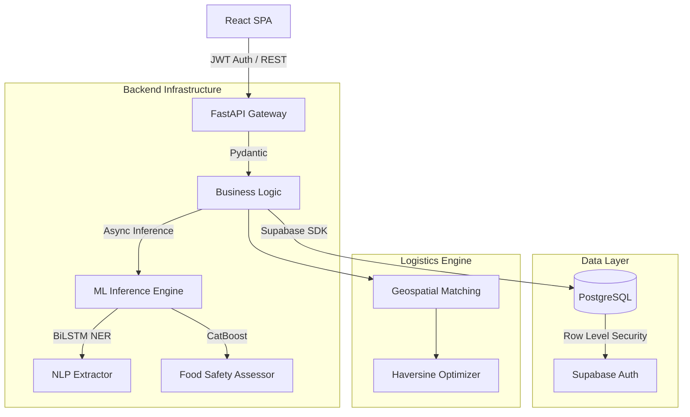

<div align="center">


# SharePlate: Engineering Case Study
**Intelligent Logistics for Surplus Food Redistribution**

[](#)
[](#)
[](#)
[](#)
[](#)
[](#)
[](#)

[Live Production](https://share-plate-ivory.vercel.app) | [Backend API](https://shareplate-6afu.onrender.com) | [API Documentation](https://shareplate-6afu.onrender.com/docs)

</div>

<br />

## Executive Summary

SharePlate is an end-to-end production system engineered to solve a specific logistics problem: the safe, rapid, and intelligent redistribution of perishable surplus food.

Food rescue is highly time-sensitive. Traditional solutions rely on manual coordination between donors and NGOs, which fails at scale due to communication friction and the inability to quickly assess food safety. SharePlate eliminates these bottlenecks by integrating Natural Language Processing (NLP) for frictionless data entry, Machine Learning (ML) for automated food safety triage, and geospatial algorithms for optimized donor-NGO matching.

This document details the engineering evolution of the platform, the machine learning research conducted, the technical challenges overcome, and the rationale behind the architectural design decisions.

---

<details>
  <summary><h2>Table of Contents</h2></summary>
  <ul>
    <li><a href="#1-system-architecture">1. System Architecture</a></li>
    <li><a href="#2-engineering-challenges--solutions">2. Engineering Challenges & Solutions</a></li>
    <li><a href="#3-machine-learning-research--experiments">3. Machine Learning Research & Experiments</a></li>
    <li><a href="#4-technical-stack--decisions">4. Technical Stack & Decisions</a></li>
    <li><a href="#5-api-architecture">5. API Architecture</a></li>
    <li><a href="#6-development-lifecycle--story">6. Development Lifecycle & Story</a></li>
    <li><a href="#7-system-workflow--interface">7. System Workflow & Interface</a></li>
    <li><a href="#8-repository-statistics">8. Repository Statistics</a></li>
    <li><a href="#9-local-setup--deployment">9. Local Setup & Deployment</a></li>
  </ul>
</details>

---

## 1. System Architecture

The system is decoupled into an asynchronous Python backend handling inference and business logic, and a TypeScript/React frontend managing state and geospatial visualization.



---

## 2. Engineering Challenges & Solutions

Building an AI-integrated production system introduced several architectural and data science challenges.

### 2.1 Target Leakage in ML Experimentation
* **Problem**: During the development of the Urgency Prediction model, the CatBoost classifier achieved a highly suspicious **99.65% accuracy** on the test set. 
* **Investigation**: Feature importance analysis revealed that the model was relying entirely on a feature called `estimated_shelf_life_hr`. I discovered that the ground-truth labels for Urgency (Low, Medium, High, Critical) were originally synthesized deterministically based on the ratio of `hours_since_prepared` to `estimated_shelf_life_hr`. 
* **Solution**: Relying on an ML model to predict a deterministic calculation is over-engineering and introduces target leakage. I discarded the ML urgency model (and the highly accurate but flawed shelf-life regressor, R² 0.9998) and refactored the pipeline.
* **Final Result**: The backend now calculates urgency using robust, deterministic business logic ($Urgency = \frac{Elapsed}{Shelf Life} * 100$), saving inference compute time and preventing data leakage.

### 2.2 Inference Memory Exhaustion (OOM)
* **Problem**: When deploying the FastAPI backend to Render's free tier (512MB RAM limit), the application crashed continuously during startup with `Error: Ran out of memory`.
* **Investigation**: Profiling the startup sequence showed that PyTorch, Scikit-Learn, and CatBoost models were being eagerly loaded into global memory via `joblib.load()` within the `__init__` block of the `AIService` class. PyTorch alone consumes ~200MB upon import.
* **Solution**: I implemented a **Lazy Loading Pattern**. Model files (`.pkl` and `.pth`) are now cached in memory only upon the first HTTP request that explicitly requires them. 
* **Final Result**: Application startup memory dropped dramatically, resolving all OOM crashes. Startup time decreased from ~8 seconds to < 2 seconds, allowing the API server to pass health checks reliably.

### 2.3 Time-Series Data Leakage in Demand Forecasting
* **Problem**: Initial experiments in demand forecasting yielded artificially high performance metrics. 
* **Investigation**: I had used `train_test_split` with `shuffle=True`. Because demand is inherently sequential, the model was training on future data to predict past data.
* **Solution**: Implemented a strict chronological train/test split. The dataset (456,548 records) was divided using the chronological `week` feature, training on early weeks and testing on later weeks.
* **Final Result**: The model's evaluation is now statistically valid, reporting a realistic Mean Absolute Error (MAE) of 113.88 on unseen future data.

---

## 3. Machine Learning Research & Experiments

The intelligence of SharePlate is driven by three primary pipelines. The complete experimentation process is documented within the `notebooks/` directory.

### 3.1 NLP Entity Extraction (PyTorch)
To reduce friction for donors, the system accepts unstructured text (e.g., *"We have 10kg of cooked rice available at MP Nagar"*). 

* **Problem**: Standard Regex fails at robustly extracting context-dependent food items and locations. Large Language Models (LLMs) via API are too slow (high latency) and expensive for simple sequence tagging.
* **Approach Evaluated**: I evaluated Spacy NER against a custom Deep Learning approach. 
* **Selected Architecture**: **PyTorch BiLSTM + Attention**. 
* **Reasoning**: A Bidirectional LSTM processes the text forwards and backwards to capture context, while the Attention mechanism allows the network to weight the importance of specific words regardless of their position. It is highly accurate, extremely lightweight (runs on CPU), and has zero API cost.
* **Dataset**: Custom tokenized dataset identifying `B-EVENT_TYPE`, `B-FOOD_TYPE`, `B-LOCATION`, `B-QUANTITY`.
* **Evaluation Metrics**:
  * Accuracy: **97.41%**
  * Precision: **97.44%**
  * F1-Score: **97.34%**

*(Training loss curves and confusion matrices extracted from Notebook 02 are available in `assets/readme/`)*

### 3.2 Food Safety Classification (CatBoost)
Donated food must be triaged immediately to prevent the redistribution of unsafe, spoiled goods.

* **Problem**: We need to classify food as `Safe`, `Review`, or `Unsafe` based on tabular features (Temperature, Humidity, Storage Condition, Time).
* **Approaches Evaluated**: Random Forest, Gradient Boosting, XGBoost, and CatBoost.
* **Selected Architecture**: **CatBoost Classifier**.
* **Reasoning**: The dataset (50,000 records, 19 features) contains numerous high-cardinality categorical variables (e.g., Packaging Type, Preparation Method). CatBoost handles categorical features natively without requiring massive One-Hot Encoding transformations, outperforming XGBoost in both training time and memory footprint on this specific dataset.
* **Evaluation Metrics**:
  * Accuracy: **92.35%**
  * Weighted F1: **0.92**

### 3.3 Demand Forecasting (Deep Neural Network)
Predicting future NGO demand to optimize geographical logistics.

* **Problem**: Understanding non-linear relationships between pricing, seasonality, and promotional activities on food demand.
* **Architecture**: PyTorch Deep Neural Network (DNN) trained with Mean Squared Error (MSE) loss and Adam optimizer.
* **Dataset**: 456,548 records, 17 operational features.
* **Evaluation Metrics**:
  * MAE: **113.88**
  * RMSE: **198.91**

---

## 4. Technical Stack & Decisions

Every technology in this stack was chosen to address specific engineering constraints.

| Component | Technology | Engineering Rationale |
| :--- | :--- | :--- |
| **Backend** | `FastAPI` | Selected over Django/Flask because food routing and logistics require high I/O concurrency. FastAPI's native async/await event loop handles this effortlessly, and Pydantic enforces strict contract schemas for ML inference endpoints. |
| **Frontend** | `React` + `Vite` | Selected over Next.js as the application is a heavily authenticated dashboard rather than an SEO-dependent content site. Vite provides instant HMR, drastically reducing local development cycles. |
| **Database** | `Supabase` (PostgreSQL) | Chosen over MongoDB due to the highly relational nature of Donors, NGOs, and Matches. Supabase provides native Row Level Security (RLS), allowing security to be enforced at the database layer rather than relying entirely on application code. |
| **Auth** | `JWT` | Stateless JSON Web Tokens allow the FastAPI backend to verify users mathematically without hitting the database for session checks, reducing latency during high-volume inference calls. |
| **Maps** | `Leaflet` + `OSM` | Selected over Google Maps API. Leaflet is open-source and incurs zero cost while providing the necessary tile layers and geospatial rendering required for visualizing NGO routes. |

---

## 5. API Architecture

The backend exposes a strictly typed REST API. Key integration points include:

**Authentication**
* `POST /api/auth/signup` - Registers Donors/NGOs and initializes Supabase user records.
* `POST /api/auth/login` - Authenticates and returns JWT payload.

**Logistics & Matching**
* `POST /api/donations/` - Submits a new donation record.
* `GET /api/donations/me` - Retrieves tenant-isolated donation history.
* `GET /api/matches/me` - Executes the geospatial matching algorithm returning optimal NGO/Donor pairs based on Haversine distance.

**Machine Learning Inference**
* `POST /api/ai/food-safety` - Deserializes tabular input and executes the CatBoost pipeline.
* `POST /api/ai/donation-ner` - Tokenizes raw text strings and executes PyTorch BiLSTM forward pass.

*(A complete OpenAPI Swagger specification is auto-generated and hosted at `/docs` on the production server).*

---

## 6. Development Lifecycle & Story

The project evolved through a structured engineering lifecycle:
1. **Problem Definition**: Identified the logistics bottleneck in perishable food rescue.
2. **Data Collection & EDA**: Sourced and synthesized tabular logistics data and text datasets for NLP training.
3. **ML Experimentation**: Trained baseline models (Random Forest). Iterated through gradient boosting architectures. Discovered and mitigated target leakage.
4. **Model Finalization**: Selected CatBoost for tabular data and BiLSTM for NLP. Serialized models via `.pkl` and `.pth`.
5. **Backend Integration**: Built FastAPI endpoints wrapping the models. Refactored eager imports to lazy loading to solve Render OOM crashes.
6. **Frontend Integration**: Developed a React dashboard utilizing TailwindCSS. Hooked up Axios interceptors for robust JWT management.
7. **Deployment**: Pushed the stateless backend to Render and the static frontend bundle to Vercel's edge network.

---

## 7. System Workflow & Interface

*Note: The following UI screenshots are embedded from the `assets/screenshots/` directory.*

### NLP Intelligence Workflow
Rather than forcing donors to fill out complex forms, the PyTorch BiLSTM model extracts entities dynamically.

*Raw unstructured input provided by the donor.*


*The decoded sequence output mapped perfectly to database schemas.*

### Automated Food Safety Triage
The CatBoost model assesses the risk of the donation in real-time.
.png)

### NGO & Donor Dashboards
Role-Based Access Control (RBAC) ensures distinct views.


### Geospatial Logistics
Haversine matching visualizes the optimal logistics paths.


### Landing Experience


---

## 8. Repository Statistics

* **Architecture**: Full-Stack Monorepo
* **Core Languages**: TypeScript, Python, SQL
* **ML Pipelines Trained**: 4
* **Final Models Deployed**: 2 (CatBoost, PyTorch)
* **API Endpoints**: 20+
* **Database Tables**: 5 (Users, Donations, Requests, Matches, Analytics)

---

## 9. Local Setup & Deployment

The system is designed to be easily reproducible in a local environment.

### 1. Clone & Database Setup
```bash
git clone https://github.com/somiya-namdeo/SharePlate.git
cd SharePlate
```
*Provision a PostgreSQL instance via Supabase and acquire the URI.*

### 2. Backend Bootstrapping
```bash
cd backend
python -m venv venv
source venv/bin/activate  # Windows: venv\Scripts\activate
pip install -r requirements.txt
```
Create `backend/.env`:
```env
SUPABASE_URL=<YOUR_URL>
SUPABASE_KEY=<YOUR_KEY>
JWT_SECRET=<YOUR_SECRET>
```
Run the ASGI server:
```bash
uvicorn app.main:app --reload --host 0.0.0.0 --port 8000
```

### 3. Frontend Bootstrapping
```bash
cd ../frontend
npm install
```
Create `frontend/.env`:
```env
VITE_API_URL=http://localhost:8000
```
Run the Vite development server:
```bash
npm run dev
```

---

## Author & Acknowledgements

**Somiya Namdeo**
* GitHub: [somiya-namdeo](https://github.com/somiya-namdeo)
* LinkedIn: [Somiya Namdeo](https://www.linkedin.com/in/somiya-namdeo-/)

This architecture was designed to showcase the intersection of modern web development and applied machine learning.
