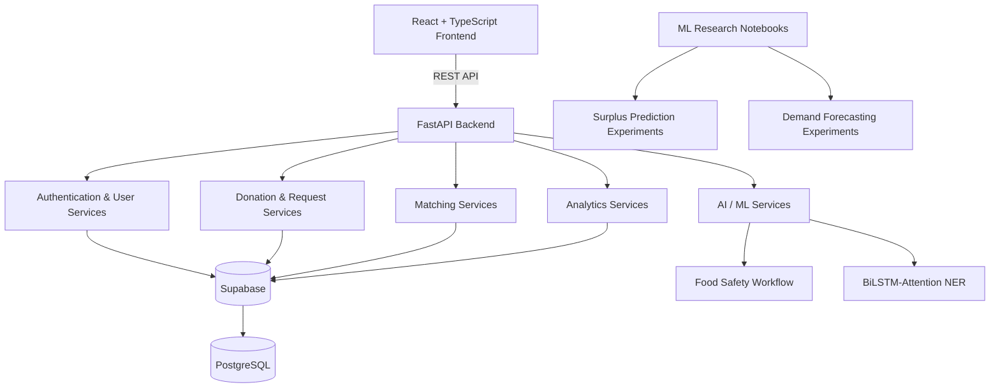

<div align="center">


# SharePlate

### AI-Powered Food Redistribution Platform

**Connecting surplus food with real community demand through AI-assisted safety assessment, NLP-based information extraction, priority-aware matching, and operational insights.**

[](https://react.dev/)
[](https://www.typescriptlang.org/)
[](https://vite.dev/)
[](https://fastapi.tiangolo.com/)
[](https://www.python.org/)
[](https://supabase.com/)
[](https://pytorch.org/)
[](https://scikit-learn.org/)

**Status:** Core application implemented and under final verification. Deployment and final screenshots are in progress.

</div>

---

## Why SharePlate?

Usable food can remain surplus while nearby communities and organizations still need meals.

The challenge is not simply that **food exists** and **demand exists**. The real challenge is coordinating them before the food loses its value.

Food redistribution involves several time-sensitive decisions:

- Is the food still safe to redistribute?
- How urgent is the donation?
- Which NGO currently needs food?
- Which donation and request should be connected?
- Has the rescue been accepted, picked up, or completed?
- What impact is the platform actually creating?

**SharePlate** is an AI-assisted food redistribution platform designed to connect food donors with NGOs and help surplus food move toward real community demand more intelligently.

Rather than functioning as only a food-listing application, SharePlate combines **donation management, NGO demand, food-safety assessment, NLP-assisted data extraction, priority-aware matching, rescue tracking, and operational analytics** into a single platform.

> SharePlate aims to reduce avoidable food waste by making food redistribution more informed, coordinated, and operationally visible.

---

## What SharePlate Does

SharePlate supports the food rescue process from donation to completion:

1. **A donor creates a food donation** with quantity, category, location, preparation, and storage information.
2. **NLP-assisted extraction** can convert unstructured donation text into structured information.
3. **Food safety is assessed** using the platform's AI-assisted safety workflow.
4. **An NGO creates a food request** based on its current meal requirements and urgency.
5. **Donations and requests are matched** using the platform's matching workflow.
6. **Donors and NGOs coordinate the rescue** through role-specific match and logistics views.
7. **Completed rescues are tracked** for both operational visibility and impact measurement.
8. **Analytics aggregate real platform data** into rescue, safety, urgency, category, and geographic insights.

---

# Core Features

## Authentication & Role-Aware Experience

SharePlate uses Supabase authentication and provides different experiences for its two primary user roles:

- **Donor**
- **NGO**

After authentication, users receive role-aware dashboards, workflows, metrics, and operational views relevant to their activity.

The platform also includes:

- editable user and organization profile information
- dynamic user identity and avatar initials
- secure password updates
- account dropdown and logout flow

---

## Food Donation Management

Donors can create and manage food donations containing information such as:

- food type and category
- quantity
- description
- address and coordinates
- preparation method
- storage condition
- packaging information
- temperature and humidity
- hours since preparation
- estimated transportation information
- contact information

Donors can track active donations and maintain visibility into completed rescue history.

---

## NGO Request Management

NGOs can create requests representing real food demand.

Requests can contain information such as:

- food or meal requirements
- meals needed
- urgency level
- address and location
- contact information
- request status

NGOs can track their requests, view matching activity, and access available donations through their operational workflow.

---

## AI-Assisted Food Safety

SharePlate includes a food-safety workflow designed to help assess whether donated food should continue through the redistribution process.

The system combines model inference with backend safety logic to evaluate information such as:

- food characteristics
- storage conditions
- temperature
- time since preparation
- estimated shelf life

The workflow produces operational information including:

- safety status
- spoilage risk
- urgency
- remaining shelf-life information

These results can be stored with the donation and used throughout the rescue workflow.

---

## NLP-Assisted Donation Extraction

SharePlate includes a **BiLSTM with Attention** model for extracting structured information from unstructured donation descriptions.

Instead of requiring every detail to be entered manually, the NLP workflow can identify useful entities such as:

- food items
- quantities
- locations
- pickup-related information

This demonstrates how NLP can reduce friction when converting natural-language donation information into structured platform data.

---

## Matching & Rescue Workflow

SharePlate connects donations and NGO requests through a structured matching workflow.

The matching system uses available operational information such as:

- donation availability
- NGO demand
- urgency
- geographic information
- rescue status

Matches progress through the statuses supported by the backend workflow, including states such as:

`pending → accepted → picked_up → completed`

Additional supported states handle cases such as rejection and cancellation.

The system also provides role-specific match views so donors and NGOs can follow their active rescue operations.

---

## Role-Aware Dashboard

The SharePlate Overview adapts to the logged-in user's role.

### Donor Overview

Donors can view information such as:

- active donations
- matches in progress
- completed rescues
- rescued quantity
- active matches
- their current donations

### NGO Overview

NGOs can view information such as:

- active requests
- matches in progress
- meals requested
- meals rescued
- active matches
- recent requests
- available donations

This keeps the Overview focused on the question:

> **What needs my attention right now?**

---

## Operations Analytics

SharePlate includes a dedicated analytics dashboard powered by real platform data rather than static dashboard values.

Analytics include operational metrics and visualizations such as:

- successful rescues
- quantity rescued
- meals fulfilled
- NGOs served
- active requests
- donations over time
- food category distribution
- safety distribution
- urgency distribution
- requests by city

The analytics layer also derives operational insights from stored donation, request, match, and safety data.

---

## Map & Logistics

SharePlate includes a map-based logistics view built around real donation and request coordinates.

The logistics workflow can:

- display relevant donation and request locations
- visualize matched rescue relationships
- focus on a specific rescue through deep-linked navigation
- provide operational context for active matches

Completed rescues are removed from the live operational map so the view remains focused on active work.

---

# Role-Based Experience

| Capability | Donor | NGO |
|---|---|---|
| Primary Action | Create food donations | Create food requests |
| Operational Tracking | Track donations and matches | Track requests and matches |
| AI Safety Workflow | Assess donation safety | View relevant donation information |
| Matching | Track NGOs matched with donations | Track donations matched with requests |
| Overview | Donation and rescue metrics | Request and meal-rescue metrics |
| History | Completed donation rescues | Fulfilled request activity |
| Logistics | View active rescue locations | View active rescue locations |

---

# System Architecture



## Frontend

The frontend is built using:

- React
- TypeScript
- Vite
- Tailwind CSS
- React Router
- Leaflet
- Recharts

It handles:

- authentication flows
- role-aware navigation
- donation and request workflows
- AI workflow interaction
- map visualization
- operational dashboards
- analytics visualization

## Backend

The backend is built with FastAPI and Python.

It is organized around:

- API routes
- Pydantic schemas
- service-layer business logic
- database operations
- AI/ML inference services

## Database & Authentication

Supabase provides:

- PostgreSQL data storage
- authentication
- profile management
- persistence for donations, NGO requests, and matches

## AI / ML Layer

The AI layer contains both:

1. **models and logic used by the active application workflow**
2. **experimental machine-learning research retained for further development**

This distinction is important because not every trained model in the repository is part of the current production user journey.

---

# Technology Stack

| Layer | Technologies |
|---|---|
| Frontend | React, TypeScript, Vite, Tailwind CSS |
| Routing & UI | React Router, Lucide React, Framer Motion |
| Maps | Leaflet, React Leaflet |
| Visualization | Recharts |
| Backend | FastAPI, Python, Pydantic, Uvicorn |
| Database | PostgreSQL |
| Backend Platform | Supabase |
| Authentication | Supabase Auth |
| Machine Learning | PyTorch, scikit-learn, CatBoost |
| Data Processing | Pandas, NumPy |
| Development | Git, GitHub, VS Code, Jupyter Notebook |

---

# AI & Machine Learning

SharePlate separates **application-integrated AI capabilities** from **experimental machine-learning research**.

## Integrated into the Application

### BiLSTM-Attention NER

The donation extraction workflow uses a PyTorch-based **BiLSTM with Attention** architecture to extract structured entities from natural-language donation descriptions.

**Purpose:** Reduce the effort required to convert free-form donation text into structured data.

**Example concept:**

```text
"We have 20 boxes of cooked rice available near Bhopal for pickup this evening."
```

The NLP workflow can identify useful entities such as food, quantity, location, and pickup-related information.

---

### Food Safety & Urgency Assessment

The food-safety workflow combines trained model inference with backend calculations and safety rules.

**Purpose:** Assist the platform in evaluating whether donated food is suitable for redistribution and how urgently it should be handled.

The workflow uses donation and environmental information to produce operational outputs related to:

- safety
- spoilage risk
- urgency
- remaining shelf life

This capability is integrated into the real donation workflow.

---

# Machine Learning Experiments

The repository also contains experimental ML workflows exploring additional problems related to food redistribution.

These experiments are intentionally documented separately from the actively integrated application features.

---

## Surplus Food Prediction Experiments

The repository includes a machine-learning workflow exploring the question:

> **Can historical event and food information help estimate how much food may remain surplus?**

The experimental pipeline investigates features related to:

- type of food
- number of guests
- event type
- quantity of food
- storage conditions
- seasonality
- preparation method
- geographical information
- engineered interaction features

Multiple regression approaches were explored, including ensemble-based models.

Depending on the exact notebook version, the experimentation includes models from the broader tree-based regression ecosystem, such as:

- Random Forest
- XGBoost
- CatBoost
- ensemble regression approaches

The repository retains the notebook and trained artifact for research and further experimentation.

> **Important:** The current surplus prediction artifact is treated as an experimental research component rather than a primary application feature. A future production version should use a deployment-ready preprocessing pipeline so categorical transformations and model inference remain reproducible.

---

## Demand Forecasting Experiments

SharePlate also includes a demand forecasting experiment exploring whether historical operational features can help estimate future food demand.

The experimental workflow uses a PyTorch deep neural network with an architecture based on:

```text
Input Features
      ↓
     128
      ↓
      64
      ↓
      32
      ↓
   Prediction
```

The network uses techniques including:

- ReLU activation
- Dropout
- feature scaling

This research workflow is retained for:

- experimentation
- retraining
- feature engineering
- future integration research

> Demand forecasting is currently an experimental capability and is not part of the primary application workflow.

---

# Experimenting with the ML Models

Researchers, students, and ML engineers can clone the repository and explore the included notebooks and model artifacts.

```bash
git clone https://github.com/somiya-namdeo/SharePlate.git
cd SharePlate
```

Create a Python environment:

```bash
cd backend
python -m venv venv
```

Activate it:

### Windows

```bash
venv\Scripts\activate
```

### macOS / Linux

```bash
source venv/bin/activate
```

Install dependencies:

```bash
pip install -r requirements.txt
```

The experimental notebooks can then be explored to:

- inspect preprocessing
- retrain models
- compare algorithms
- experiment with feature engineering
- evaluate alternative architectures
- improve deployment pipelines

> Serialized ML artifacts can be sensitive to library versions. For experimentation, retraining models in your own environment may be preferable to relying on older serialized artifacts.

---

# Core Data Model

SharePlate is centered around four primary entities.

### Profiles

Stores user and organization information for authenticated donors and NGOs.

### Donations

Represents surplus food made available by donors, including food information, safety-related data, location, and operational status.

### NGO Requests

Represents food demand submitted by NGOs, including meals needed, urgency, location, and request status.

### Matches

Connects a donation with an NGO request and tracks the rescue lifecycle.

Conceptually:

```text
Donor
  │
  └── Donation
         │
         ├──── Match ──── NGO Request
         │                    │
         │                    └── NGO
         │
         └── Food Safety Data
```

---

# Project Structure

```text
SharePlate/
│
├── frontend/
│   ├── src/
│   │   ├── components/       # Reusable UI and dashboard components
│   │   ├── pages/            # Application pages and workflows
│   │   ├── lib/              # API and authentication utilities
│   │   └── ...
│   └── package.json
│
├── backend/
│   ├── app/
│   │   ├── routes/           # FastAPI endpoints
│   │   ├── schemas/          # Pydantic request/response models
│   │   ├── services/         # Business logic and AI services
│   │   └── main.py           # FastAPI application entry point
│   ├── requirements.txt
│   └── supabase_schema.sql
│
├── notebooks/
│   ├── 01_SharePlate_Surplus_Food_Prediction.ipynb
│   └── 03_SharePlate_Demand_Forecasting.ipynb
│
├── models/                   # Trained model artifacts, if retained here
│
└── README.md
```

> The exact structure may evolve as the project is finalized and deployed.

---

# API Overview

The FastAPI backend exposes REST endpoints grouped around the application's main domains.

| Domain | Purpose |
|---|---|
| Authentication | Registration, login, authentication, password management |
| Users | User and profile management |
| Donations | Create, retrieve, and update food donations |
| NGO Requests | Create and manage food demand |
| Matches | Connect donations with NGO requests and track rescue status |
| AI | Food-safety and NLP-related inference workflows |
| Analytics | Aggregated operational metrics and visualizations |

FastAPI's interactive API documentation can be used during local development.

```text
http://localhost:8000/docs
```

---

# Running Locally

## Prerequisites

You will need:

- Node.js
- npm
- Python 3
- a Supabase project
- Git

---

## Clone the Repository

```bash
git clone https://github.com/somiya-namdeo/SharePlate.git
cd SharePlate
```

---

## Backend Setup

```bash
cd backend

python -m venv venv
```

Activate the environment:

### Windows

```bash
venv\Scripts\activate
```

### macOS / Linux

```bash
source venv/bin/activate
```

Install dependencies:

```bash
pip install -r requirements.txt
```

Configure the required backend environment variables using your own Supabase credentials.

> Never commit API keys, passwords, service-role keys, or other secrets to GitHub.

Start the FastAPI server using the command configured for the project, for example:

```bash
uvicorn app.main:app --reload
```

The API will typically be available at:

```text
http://localhost:8000
```

Interactive API documentation:

```text
http://localhost:8000/docs
```

---

## Frontend Setup

Open a new terminal:

```bash
cd frontend
npm install
```

Create the frontend environment configuration:

```env
VITE_API_URL=http://localhost:8000
```

Start the development server:

```bash
npm run dev
```

The frontend will typically be available at:

```text
http://localhost:5173
```

---

# Project Status

The core SharePlate application is implemented and currently undergoing final verification and deployment preparation.

### Implemented

- [x] Donor and NGO authentication
- [x] Role-aware application experience
- [x] Donation management
- [x] NGO request management
- [x] NLP-assisted donation extraction
- [x] AI-assisted food-safety workflow
- [x] Donation-request matching
- [x] Rescue lifecycle tracking
- [x] Map-based logistics view
- [x] Role-aware Overview dashboards
- [x] Operational analytics
- [x] Profile and account settings
- [x] Password management

### In Progress

- [ ] Final end-to-end verification
- [ ] Production deployment
- [ ] Final application screenshots
- [ ] Final documentation polish

---

# Screenshots

Final application screenshots will be added after deployment and final UI verification.

---

# Future Improvements

Potential future improvements include:

- server-side filtering and pagination for larger datasets
- production-scale monitoring and observability
- expanded geographic matching strategies
- richer notification workflows
- continued surplus prediction research
- continued demand forecasting experimentation
- model monitoring and reproducible retraining pipelines

---

# Contributing & Experimentation

Developers, students, and ML practitioners are welcome to fork the repository and explore areas such as:

- NLP extraction
- food-safety modelling
- surplus prediction
- demand forecasting
- matching strategies
- feature engineering
- scalable API design
- analytics and visualization

The experimental notebooks are intended to make the repository useful not only as an application, but also as a foundation for further ML experimentation.

---

# Author

**Somiya Namdeo**

GitHub: [somiya-namdeo](https://github.com/somiya-namdeo)

---

<div align="center">

### SharePlate

**Turning surplus into an opportunity to serve.**

</div>
