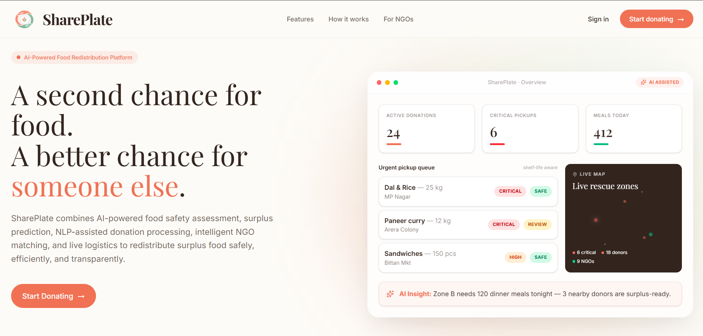
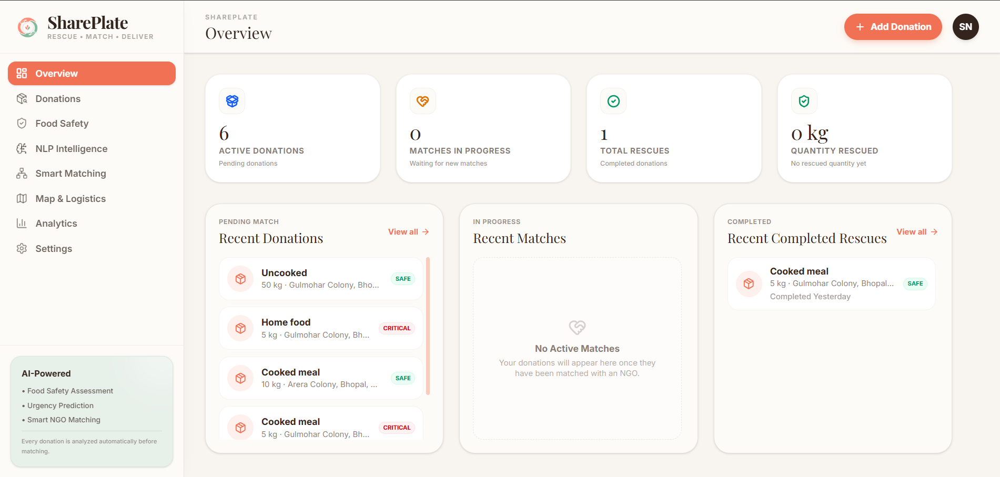
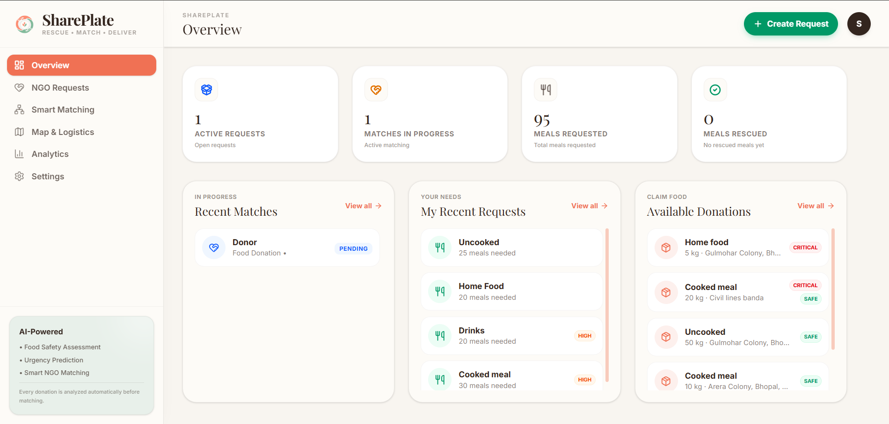
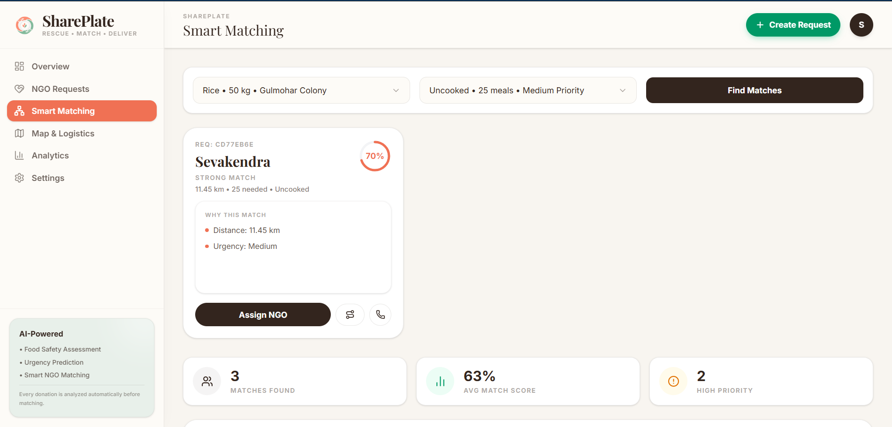
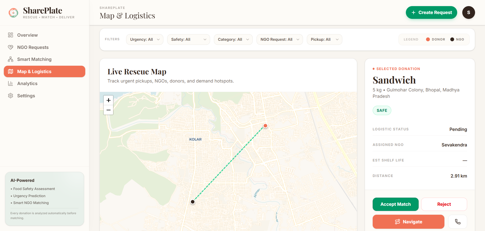
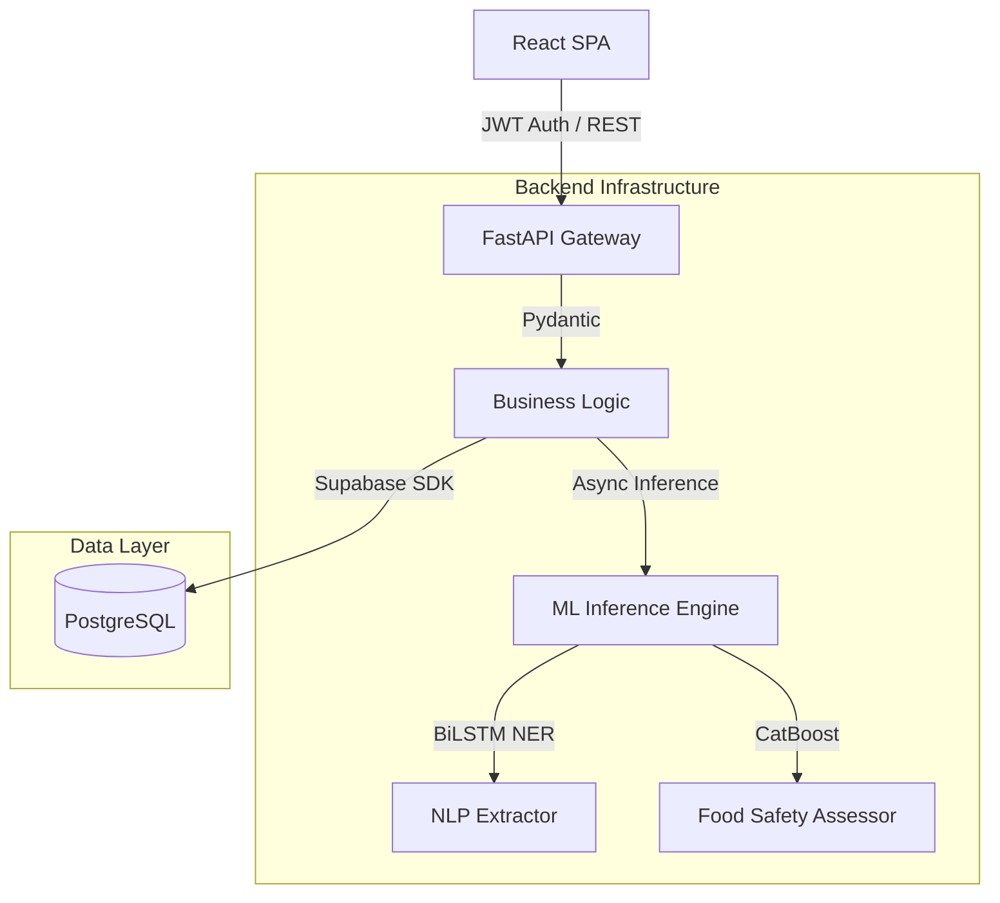

<div align="center">


# SharePlate
### AI-Powered Food Redistribution Platform

SharePlate is a full-stack AI-powered platform that connects food donors with NGOs using Machine Learning, Natural Language Processing, and geospatial logistics to reduce global food waste and optimize food redistribution.

[](#)
[](#)
[](#)
[](#)
[](#)
[](#)

[Live Production](https://share-plate-ivory.vercel.app) | [Backend API](https://shareplate-6afu.onrender.com) | [API Documentation](https://shareplate-6afu.onrender.com/docs)

</div>

<br />

## Overview

Globally, nearly one-third of all food produced is wasted, yet millions suffer from food insecurity. 

The core issue isn't a lack of food—it's a massive logistics and communication bottleneck. Traditional food rescue operations rely heavily on manual coordination. For donors, it's difficult to know who needs the food and coordinating pickups takes too much effort. For NGOs, it's nearly impossible to manually assess the safety and perishability of every spontaneous donation at scale.

I built SharePlate to solve this. By integrating AI at the core of the platform, SharePlate automates the heavy lifting: from effortlessly understanding raw text donations, to predicting food safety, and finally routing the food to the optimal NGO.

---

## Key Features

Before diving into the artificial intelligence that powers the platform, here is what SharePlate actually does:

* **AI Food Safety Prediction:** Instantly predicts human-consumption safety based on tabular donation data.
* **NLP Donation Extraction:** Donors submit raw, unstructured text; the system parses it automatically.
* **Smart NGO Matching:** Uses Haversine distance and urgency routing to match donors with the optimal NGO.
* **Interactive Maps:** Real-time geospatial rendering of active logistics and rescue zones.
* **Analytics Dashboard:** Tenant-isolated tracking of organizational impact and meals rescued.
* **Role-Based Authentication:** Distinct workflows, dashboards, and security rules for Donors vs. NGOs.

---

## Platform Screenshots

### Landing Experience

*Primary marketing interface, highlighting core value propositions and platform statistics.*

### Donor Experience

*Donor view showing real-time analytics, active donations, and historical contribution data.*

### NGO Experience

*NGO centralized view of claimed donations, pending logistics, and organizational impact.*

### AI Features

*Raw unstructured input provided by the donor.*


*The decoded sequence output mapped perfectly to the database schema.*

.png)
*Real-time CatBoost risk triage evaluating food safety.*

### Logistics

*Algorithmically generated list of optimal NGO matches based on urgency and distance.*


*Visualizing geospatial data using Leaflet to display live rescue zones and routing paths.*

---

## Project Journey

I started this project with a simple question: *How can we make food donation completely frictionless while guaranteeing safety?*

After researching existing food donation workflows, I realized that donors abandon the process if it takes too long to fill out forms, and NGOs reject food if they can't verify its shelf life. This led me to synthesize tabular logistics data for food safety and build text datasets for donation requests.

When the dataset was ready, a new challenge appeared: simple rules couldn't handle the complexity of food safety. I began experimenting with machine learning, iterating through baseline models like Random Forest before discovering the strengths of gradient boosting algorithms on high-cardinality data.

With safety handled, I still needed to remove the friction for donors. This naturally transitioned into NLP development. I built a custom Deep Learning model to extract entities directly from unstructured text rather than forcing donors to fill out tedious forms. 

Finally, I wrapped these trained models in a highly concurrent asynchronous backend and built a clean, role-based React dashboard to visualize the logistics, bridging the AI predictions with real-world users.

---

## AI & Machine Learning

This is the heart of SharePlate. The machine learning pipeline is the engine that drives the entire application.

### Food Safety Prediction

**The Problem**  
When an event organizer has 50kg of surplus food, an NGO needs to instantly know: *Is this safe to eat, and how much time do we have to transport it?*

**The Approach & Models Tried**  
I framed this as a multi-class classification problem. The dataset consisted of 50,000 synthesized records with 19 features (including `temperature`, `humidity`, `hours_since_prepared`, and `packaging_type`).

I evaluated several algorithms:
* **Random Forest**: Provided a solid baseline but struggled with the high-cardinality categorical variables.
* **Gradient Boosting**: Improved accuracy but required massive one-hot encoding matrices, which slowed down training.
* **XGBoost & LightGBM**: Offered great performance, but hyperparameter tuning for the categorical splits was tedious.
* **CatBoost**: Handled the categorical features natively and built optimal decision trees significantly faster.

**Why the Final Model?**  
CatBoost was selected because it naturally processes categorical data without requiring heavy preprocessing or bloated one-hot encoding. It outperformed the others in both training time and memory footprint on this specific dataset.

**Final Performance**  
The deployed CatBoostClassifier triages donations into `Safe`, `Review`, or `Unsafe`.
* **Accuracy:** 92.35%
* **Weighted F1-Score:** 0.92

### NLP Entity Extraction

**The Problem**  
Donors want to type *"We have 10kg of cooked rice available at MP Nagar"* and be done. 

**The Approach**  
Regex was immediately ruled out—it fails at robustly extracting context-dependent entities like obscure food items or unique location names. Calling external Large Language Models (LLMs) via API introduces unacceptable latency and cost for a simple sequence tagging task.

**Why BiLSTM + Attention?**  
I built a custom Sequence Tagging model using PyTorch. A Bidirectional LSTM processes the text both forwards and backwards, capturing the context of a word based on the entire sentence. The Attention mechanism allows the network to assign dynamic weights to the most important words. It is incredibly lightweight, runs natively on the CPU, and executes in milliseconds.

The model extracts four entities: `B-EVENT_TYPE`, `B-FOOD_TYPE`, `B-LOCATION`, and `B-QUANTITY`, instantly converting raw text into structured JSON.

**Final Performance**  
* **Accuracy:** 97.41%
* **Precision:** 97.44%
* **F1-Score:** 97.34%

*(Training loss curves and extracted confusion matrices are available in the `assets/readme/` folder).*

### Demand Forecasting

**The Problem**  
NGOs need to anticipate surplus trends to allocate their volunteers effectively across different geographic zones.

**Dataset & Architecture**  
I used 456,548 historical logistics records comprising 17 operational features. The architecture is a PyTorch Deep Neural Network (DNN) trained with Mean Squared Error (MSE) loss and the Adam optimizer.

**Training & Evaluation**  
To prevent time-series data leakage (where a model inadvertently trains on future data to predict the past), I used a strict chronological train/test split. 

**Final Performance**  
The model achieved a highly realistic Mean Absolute Error (MAE) of **113.88** on unseen future weeks.

---

## Architecture

The system is decoupled into a frontend client, an asynchronous Python backend, and an intelligent data layer.



* **Frontend**: React handles the state, routing, and geospatial map rendering.
* **Backend**: FastAPI orchestrates the async REST endpoints and business logic.
* **AI Engine**: PyTorch and CatBoost serialize inference within the backend.
* **Database**: Supabase manages the PostgreSQL tables and Row Level Security.

---

## Lessons Learned

Building a full-stack AI application taught me several practical engineering lessons:

* **Why Model Comparison Matters**: Starting with simple models like Random Forest provided a baseline that ultimately proved CatBoost's superiority in handling tabular data without heavy preprocessing.
* **The Importance of Feature Engineering**: Knowing which features actually contribute to food spoilage completely dictated the success of the classification models.
* **Detecting Target Leakage**: During experiments, I built an 'Urgency' model that hit 99.6% accuracy. Investigating this anomaly revealed the model was mathematically cheating because the label was derived directly from an input feature. It reinforced the importance of rigorously auditing feature sets.
* **Choosing the Right Evaluation Strategy**: In demand forecasting, switching from a random data split to a chronological split completely changed the metrics, proving that time-series models must be evaluated against the future, not the past.

---

## Technology Stack

<div align="center">
  
  
  
  
  
  
  
  
  
</div>
<br />

| Component | Technology | 
| :--- | :--- | 
| **Machine Learning** | `PyTorch`, `CatBoost`, `Scikit-Learn`, `Pandas` |
| **Backend API** | `FastAPI`, `Python`, `JWT` |
| **Frontend UI** | `React`, `TypeScript`, `Vite`, `Tailwind CSS` |
| **Database** | `Supabase` (PostgreSQL) | 
| **Geospatial Maps** | `Leaflet`, `OpenStreetMap` |

---

## API Reference

The backend exposes a strictly typed REST API. Key endpoints include:

* `POST /api/auth/signup` - Registers Donors/NGOs and initializes records.
* `POST /api/auth/login` - Authenticates and returns JWT payload.
* `POST /api/donations/` - Submits a new donation record.
* `GET /api/matches/me` - Executes geospatial matching returning optimal NGO/Donor pairs based on Haversine distance.
* `POST /api/ai/food-safety` - Deserializes tabular input and executes the CatBoost pipeline.
* `POST /api/ai/donation-ner` - Tokenizes raw text strings and executes the PyTorch BiLSTM forward pass.

---

## Local Setup

### 1. Clone & Database Setup
```bash
git clone https://github.com/somiya-namdeo/SharePlate.git
cd SharePlate
```

### 2. Backend Bootstrapping
```bash
cd backend
python -m venv venv
source venv/bin/activate  # Windows: venv\Scripts\activate
pip install -r requirements.txt
```
Create `backend/.env`:
```env
SUPABASE_URL=<YOUR_URL>
SUPABASE_KEY=<YOUR_KEY>
JWT_SECRET=<YOUR_SECRET>
```
Run the server:
```bash
uvicorn app.main:app --reload --host 0.0.0.0 --port 8000
```

### 3. Frontend Bootstrapping
```bash
cd ../frontend
npm install
```
Create `frontend/.env`:
```env
VITE_API_URL=http://localhost:8000
```
Run the development server:
```bash
npm run dev
```

---

## Future Work

* **Independent Volunteer Routing**: Expand the ecosystem with a dedicated volunteer application to optimize and crowdsource last-mile delivery.
* **OCR-Assisted Data Entry**: Implement Optical Character Recognition to allow corporate donors to automatically digitize physical inventory manifests.
* **Computer Vision Spoilage Detection**: Augment the existing ML pipeline with Convolutional Neural Networks (CNNs) to detect spoilage directly from uploaded donation images.

---

## Contributing

Contributions are always welcome. Whether you're interested in improving the AI models, optimizing the logistics algorithms, or enhancing the frontend dashboard, feel free to open a Pull Request. For major bugs or feature requests, please open an Issue first to discuss your ideas.

## Collaboration

I am always interested in collaborating on projects involving Artificial Intelligence, Machine Learning, NLP, Computer Vision, and Full-Stack Development. If you have an interesting idea or research opportunity, feel free to reach out.

## Connect

<div align="center">
  <a href="https://github.com/somiya-namdeo">
    
  </a>
  <a href="https://www.linkedin.com/in/somiya-namdeo-/">
    
  </a>
</div>

<br />

SharePlate demonstrates the integration of Machine Learning, Natural Language Processing, and Full-Stack Engineering to solve real-world food redistribution challenges.
